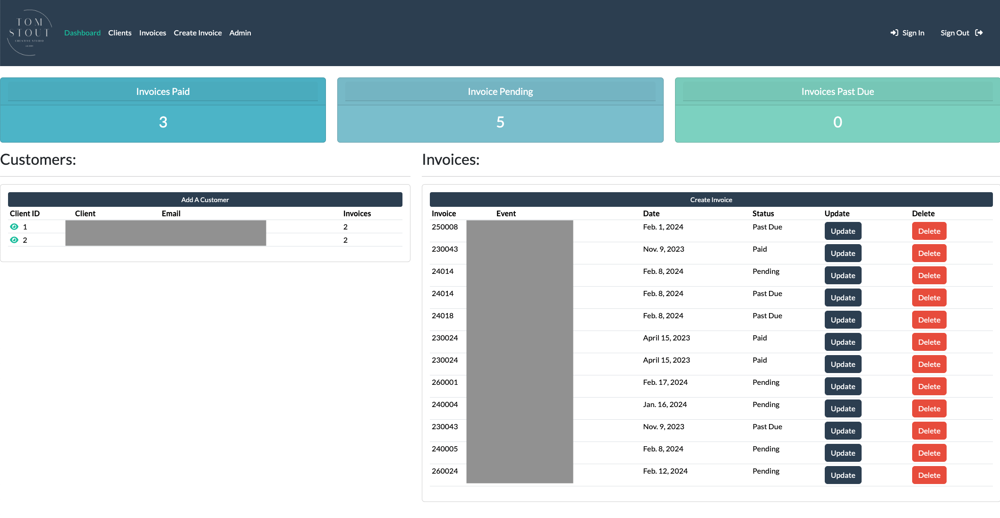
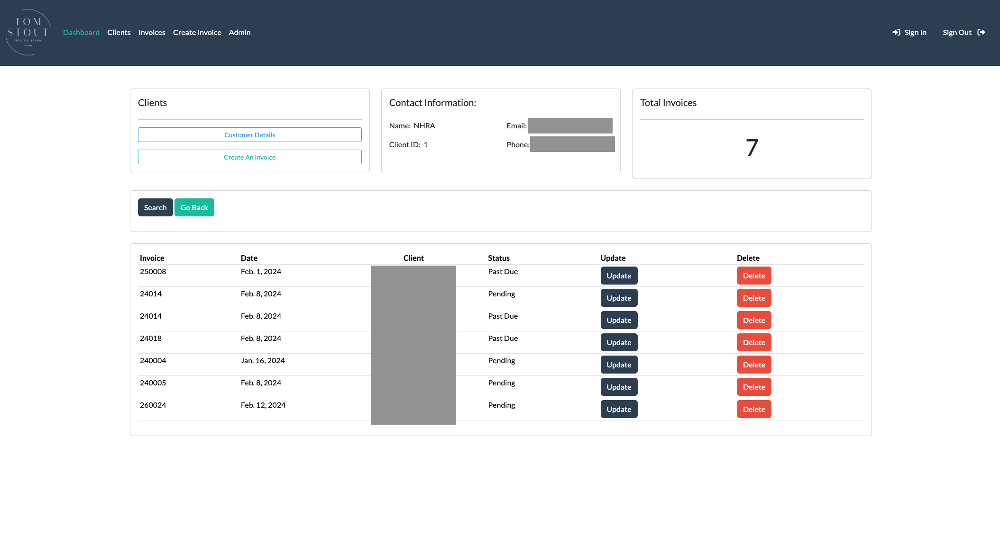
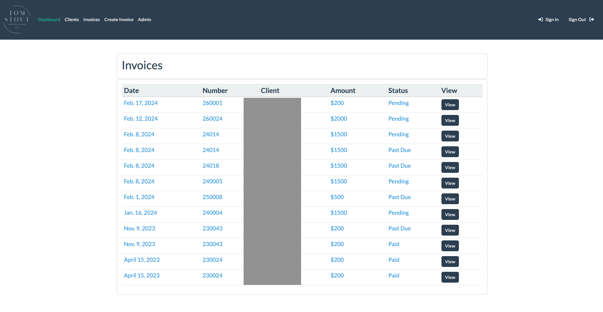

><h1 align="center">Studio Manager<h1>
<h3>Clients & Invoices</h3>

___

> 

  

> This is a Django Projuct for Photographers

Includes:
1. Custom Settings File
2. Register/Login Functions
3. Client Page
4. Client CRUD operations
5. Invoices Page
6. Invoice CRUD operations
7. PostgreSQL Database
8. Custom Admin Panel

___

<h1 align="center">Screenshots</h1>

> 

